# DirectlineJabber.Demo Bot
This project demonstrates the use of [Directline-Jabber](https://github.com/jvanderbiest/directline-jabber/). The tutorial does not require any experience with botframework and starts from scratch. If you already have an existing bot and directline channel setup, please feel free to skip the first steps and jump directly to [Run directline-jabber](#run-directline-jabber).

# Prerequisites
[Visual Studio 2019 (Community Edition)](https://visualstudio.microsoft.com/downloads/)

[Bot Framework v4 SDK Templates for Visual Studio](https://marketplace.visualstudio.com/items?itemName=BotBuilder.botbuilderv4) - v4.4.4 (2019-06-03)

[Bot Framework Emultor](https://github.com/microsoft/BotFramework-Emulator/releases) - v4.4.1

[Azure Subscription](https://azure.microsoft.com/en-in/free/)

[ngrok](https://ngrok.com/download)

[Directline-Jabber](https://github.com/jvanderbiest/directline-jabber/releases) - v1.0.2

[Node.js](https://nodejs.org/en/) - >v10

# Setup Visual Studio Project
For demo purpose we just kick of with a default template bot. To make use of the template, download the [Bot Framework v4 SDK Templates for Visual Studio](https://marketplace.visualstudio.com/items?itemName=BotBuilder.botbuilderv4) or download the source of this repository to just open the project.

Creating a new project by selecting the "echo bot" template.

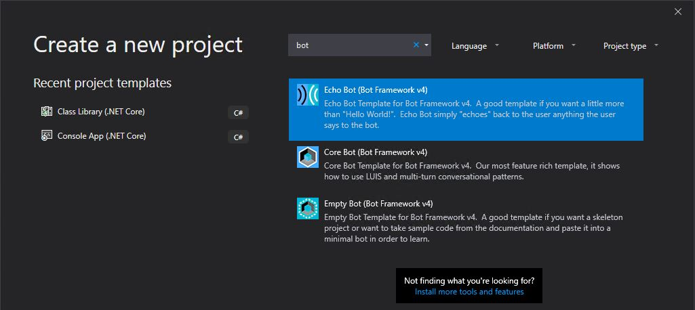

We need to authenticate using directline, so let's setup the directline channel first.

# Create Azure Resources
## Bot Channels Registration
In Azure navigate to all services and look for "Bot Channels Registration".

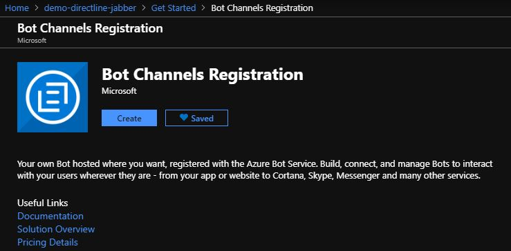

Then fill in the required fields and create a new Microsoft App Id and Password. Keep track of this AppId and Password to use later with the bot.

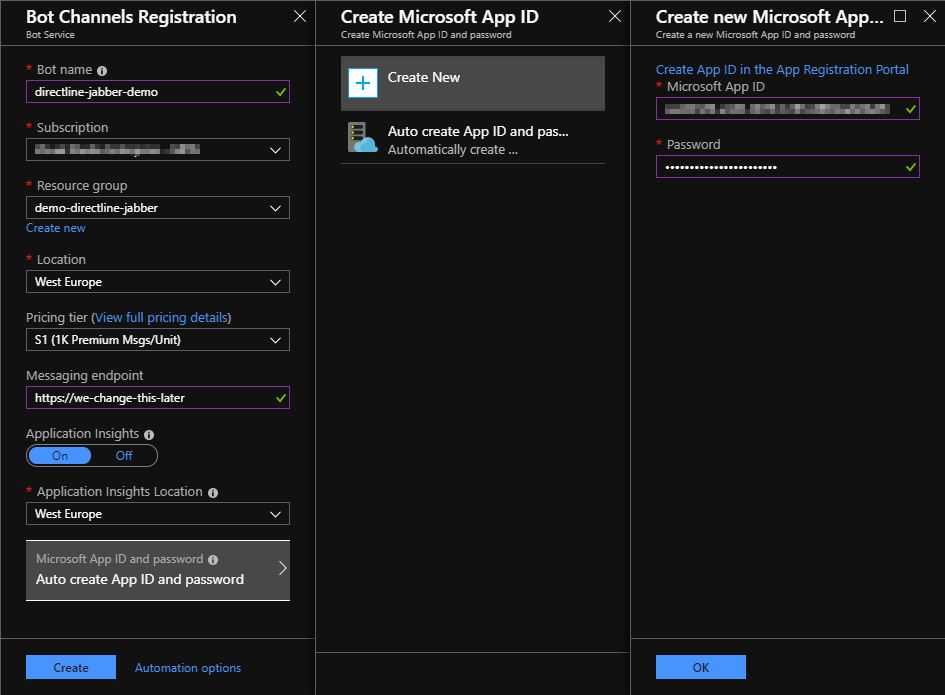
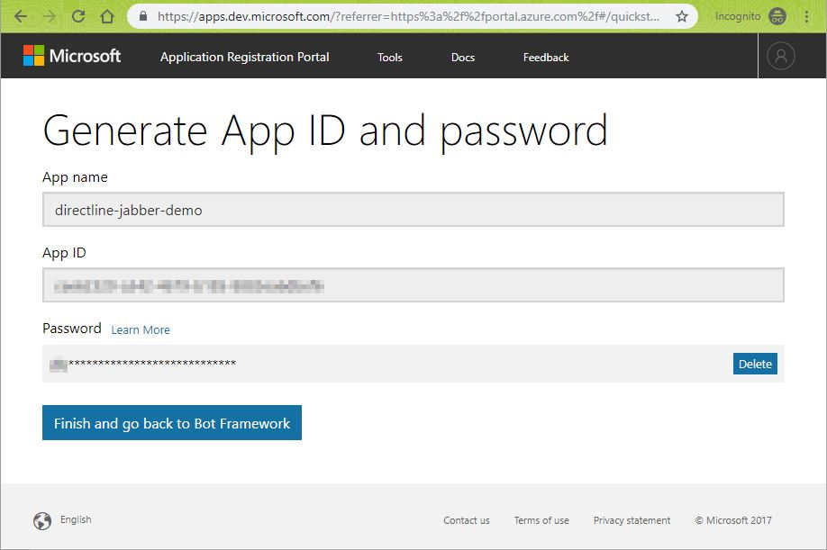

Navigate to the newly created resource and navigate to channels. Create a directline channel.
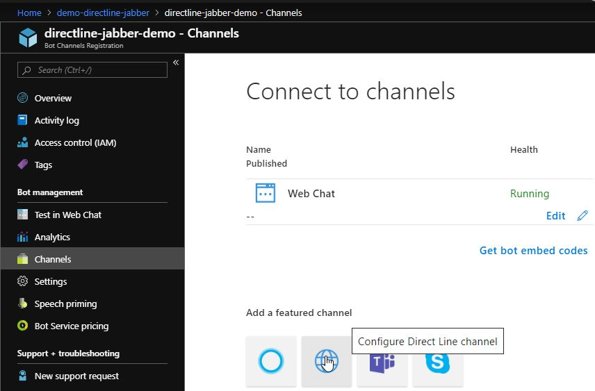

Keep track of the directline secret to use later with the bot.
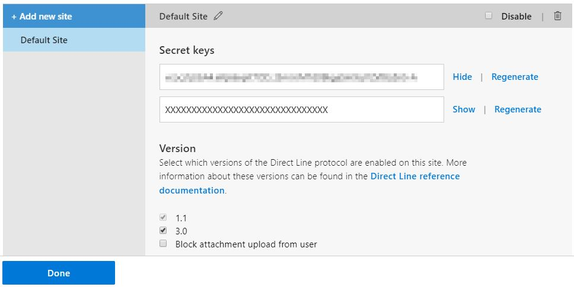

# Testing the bot using directline-jabber
# Generate a test case
To test the bot, we need to generate a chat transcript or create a chatdown file.

First, let's setup our bot service authentication in the Visual Studio project. Navigate to the appsettings.json file and enter the Microsoft AppId and AppPassword that you generated earlier.

Then start the bot (F5) and note the bot messaging address, in our case `http://localhost:3978/api/messages`
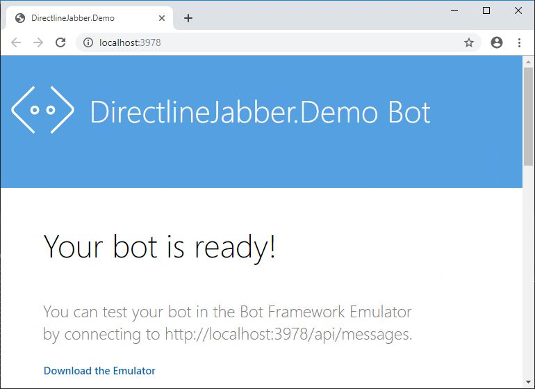

Launch an instance of the bot framework emulator and create a new configuration.
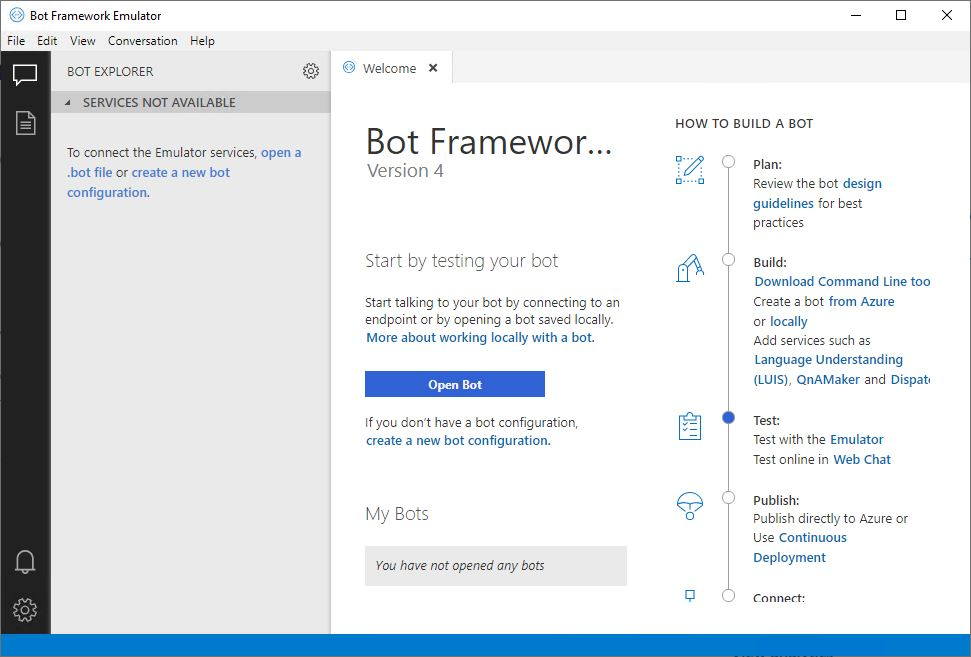

Fill in the same Microsoft AppId and AppPassword. 

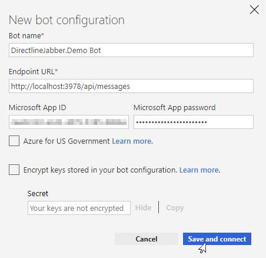

Start a bot chat conversation and save the transcript.
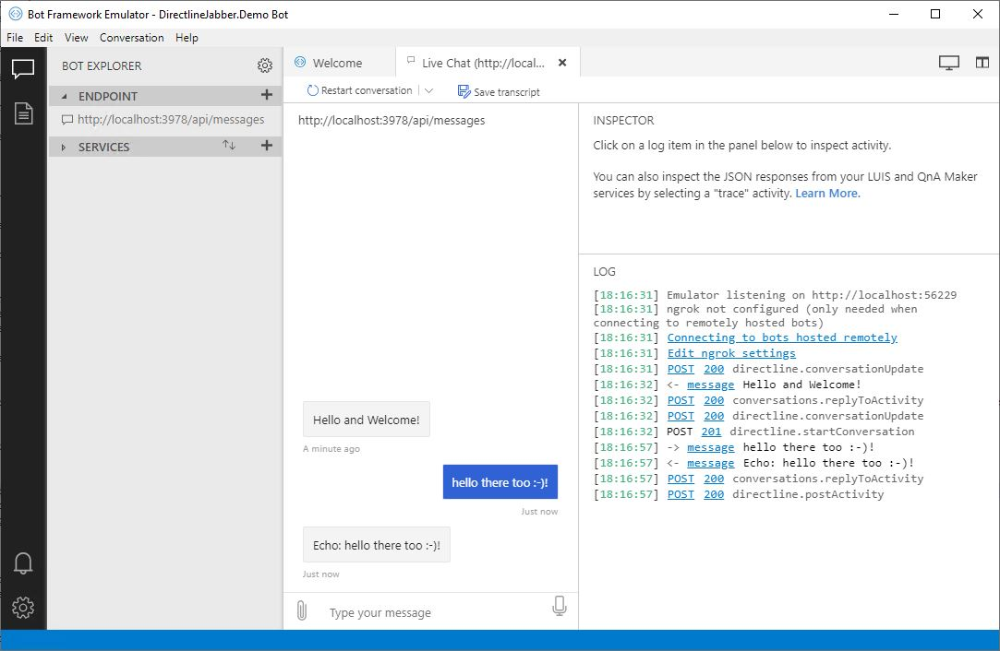
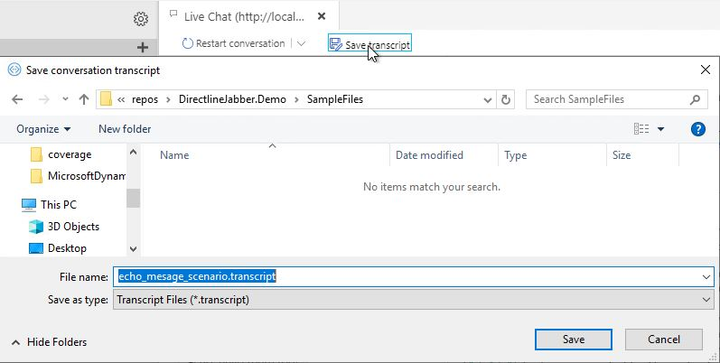

# Testing a bot on your local machine
To be able to tunnel traffic from a directline channel to your local bot, we will use the tunneling software [ngrok](https://ngrok.com/download), you can read more about it [here](https://blog.botframework.com/2017/10/19/debug-channel-locally-using-ngrok/) but basically ngrok forwards messages from external channels on the web directly to our local machine to allow debugging, as opposed to the standard messaging endpoint configured in the Bot Framework portal.

## Configure ngrok
After ngrok installation, run it with the correct address, then copy the https forwarding ngrok address.
`ngrok.exe http -host-header=localhost:3978 3978`
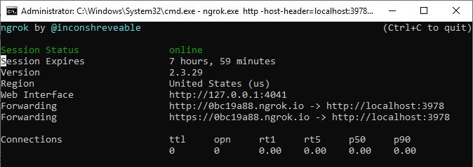

We use this ngrok address as messaging endpoint in our bot channels registration settings on Azure. Make sure you add the /api/messages to the endpoint.
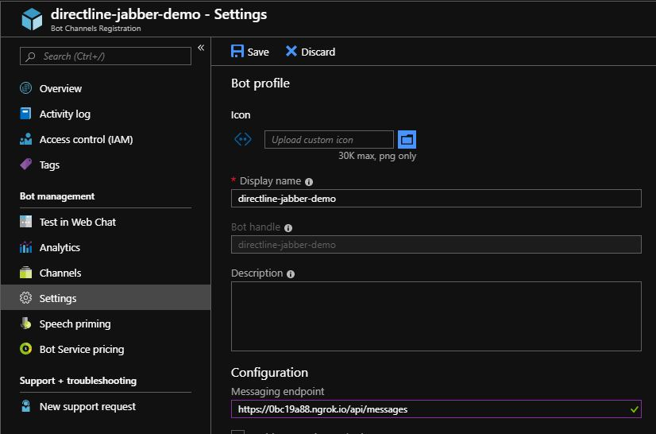

You are all set to have directline-jabber run your conversations. Jump to [Run directline-jabber](#run-directline-jabber).

# Testing a deployed bot
## Deploying to the cloud
To get the bot running in the cloud, we will deploy our bot from Visual Studio using an Azure App Service. Right click the project and select `Publish`

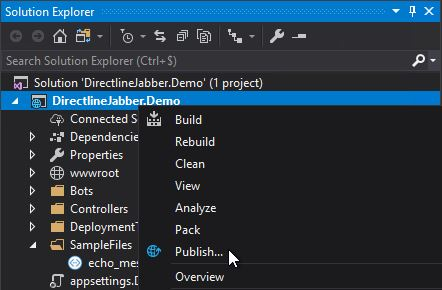

Then use the default settings to publish to a new App Service
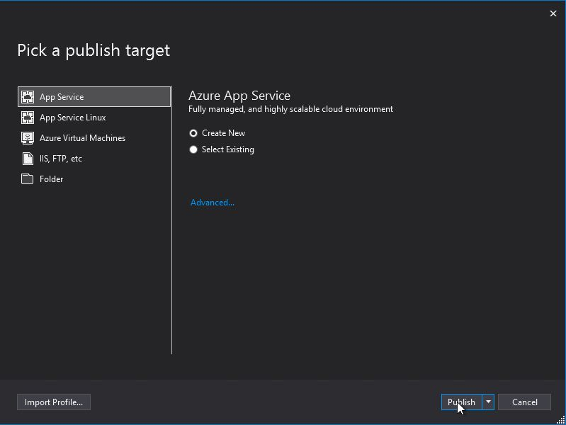
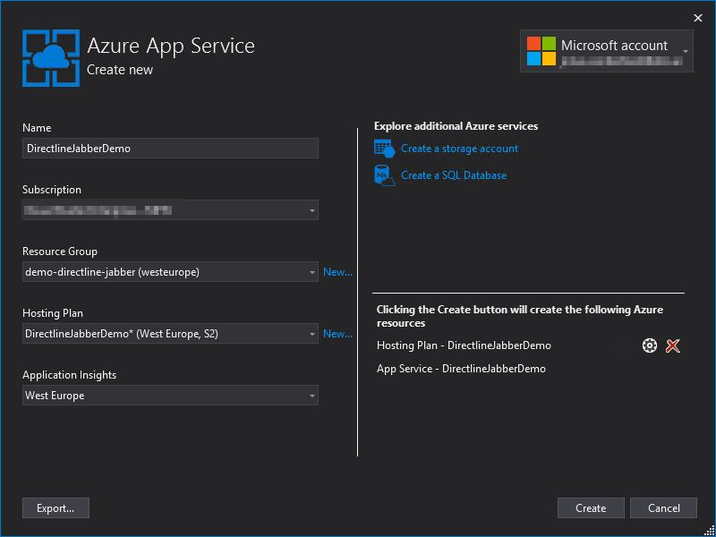
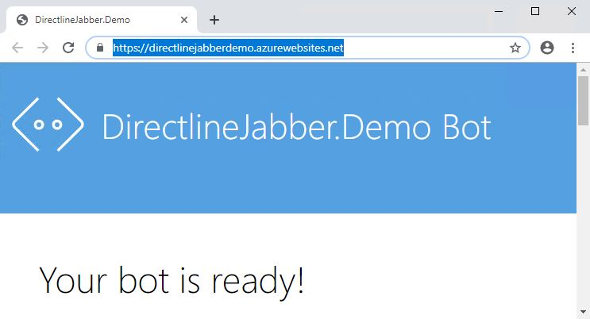

We use this new address as messaging endpoint in our bot channels registration settings on Azure.
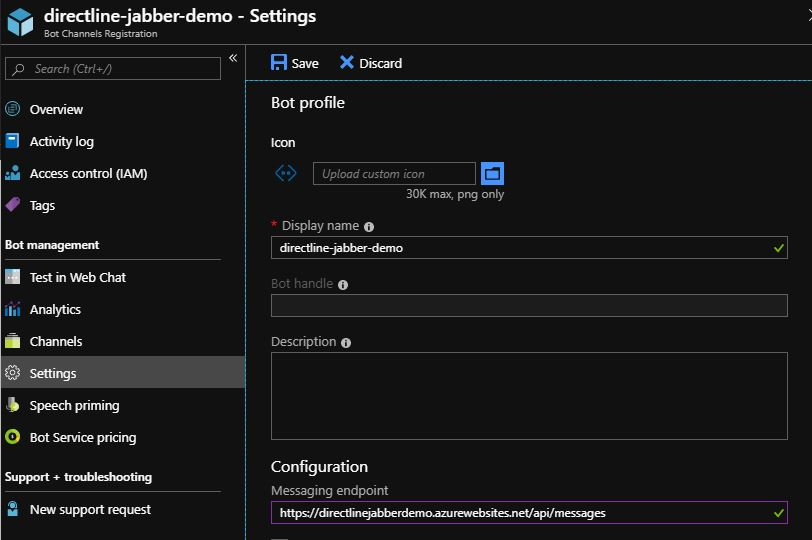

# Run directline-jabber
Install a local version of directline-jabber (extract a [release *.tgz archive](https://github.com/jvanderbiest/directline-jabber/releases) or install using [npm](https://www.npmjs.com/package/directline-jabber))

Navigate to the app.js file in a Node.js command prompt and execute the following command:
`node app.js test --dirs [your-folder-with-chat-files] --secret [your-directline-secret]`

Directline-jabber will go trought the test files and will use your directline channel using the directline secret key. You should have a similar output:
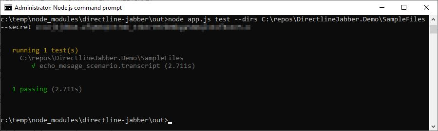

# Alternative token authentication
If you want to use a [token endpoint](https://docs.microsoft.com/en-us/azure/bot-service/rest-api/bot-framework-rest-direct-line-3-0-authentication?view=azure-bot-service-4.0) for authentication, check out the [implementation here](./Controllers/TokenController.cs). Then when you call the endpoint it will generate a token for communication with directline for you.

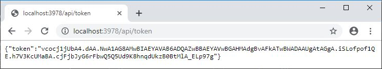